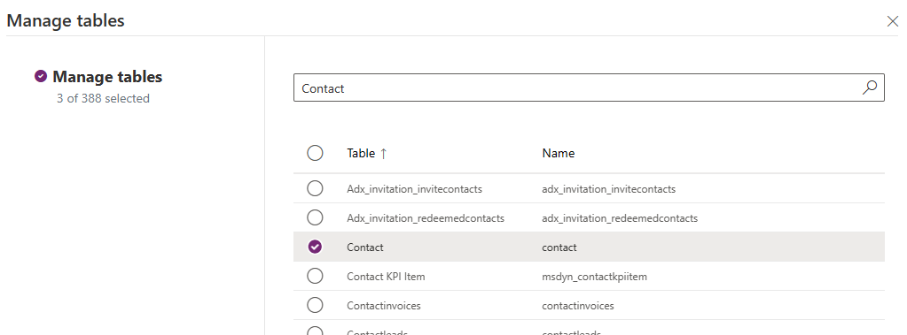

[Home](Readme-shell.md) 

# Task number 8: Dataverse link for Fabric

This will walk you through the end to end process of setting up Dataverse Link for Fabric in your environment to test.

## Initial Prequisites
### Creating a Dataverse Database and Adding Sample Data
While signed in as your External Account Admin go to https://admin.powerplatform.microsoft.com/ click Environments and then your Environment.
It will be your tenant name followed by (default).

Next you will have to add the Dataverse database to the environment. To do that click Add Dataverse.


In the popout make sure you enable D365 apps. I personally used the "None" security group to make setup easier. Click Save.


Now let's add some sample data. Once your Dataverse Database is fully deployed, go back to your environment and click the settings button on the top bar. Expand the Data management node and click Sample data to open the Sample Data wizard. 


Click the Install Sample Data button in the lower right hand corner to create the sample data in the background.

Now you can go to https://powerapps.com to verify the data exists. Once you are signed in, go to Tables and click Account, you should see a list of accounts now populated in your Dataverse environment.

### Creating the Dataverse connection in Fabric

Go to the Fabric portal, go to the settings gear and click Manage connections and gateways, and then click the New button at the top.


Make sure you have your D365 Environment URL (From Power Platform Admin, click environments, and select your environment to get your Environment URL)

Click the Cloud radio button, the connection name must be your Environment URL, click the Connection type dropdown and select Dataverse.

The environment domain is the Environment URL, Authentication method is OAuth 2.0. Make sure to click Edit credentials to fully sign in. Everything else can be left to defaults. Click Create to finish.


## Creating the Dataverse Link

Now, let's go to the Power Apps portal, you have to use this link specifically to enable the preview feature: https://make.preview.powerapps.com/?athena.shortcuts=true&athena.mdl=true&athena.cds2=true

Click on Tables, click the three dots by Account, click Export, Link to Microsoft Fabric (preview). This will open the Link creation menu.

On the popout make sure to note the name as this will be both the Lakehouse and Workspace name.

Note: If you run into an error about "Unable to create workspace with available capacity" you will need to go into the Azure portal and create a small fabric capacity that Dataverse Link can attach to.

Click Ok on the bottom of the screen, after a moment your browser will redirect you to the Fabric Lakehouse that is linked to Dataverse.

Go back to the Power Apps portal, on the left hand menu click Azure Synapse Link (it may be in the "More" menu if you don't see it right away)

You should see "Azure Synapse Link for Dataverse" and a menu that says "Managed Store". Click the three dots to open the menu and click Tables. Here you can see the status of your Dataverse linked tables. Wait until "Initial sync in progress" changes to "Active" with a check mark. You will also want to verify the "Fabric Status" column says Created.


## Testing the Dataverse Link
### Query the linked table
For some quick testing, let's open the SQL Endpoint in the Lakehouse to see how many rows are in the table. You can run a query such as 
```sql 
SELECT COUNT(*) FROM account
``` 
to see the number of rows or 
```sql
SELECT Count(*) FROM INFORMATION_SCHEMA.COLUMNS where TABLE_NAME = 'account'
``` 
to see the number of columns (which should be over 200).

### Show the sync process
Go back to the Power Apps portal and go to Tables. Click on the Account table and click the Add more rows button. 

Add a new Account, you will need to add a Name, Phone Number, and City. Hit enter and then the back button to write your row. 


Once you have written your row, go back to the Azure Synapse Link menu (Left column menu, More, Azure Synapse Link), and click Managed Store to see your Linked tables status again. From here you can see the Last Synchronized on column showing if your data has been sync'd, this can take a few minutes depending on what else is going on in Dataverse at the moment.

Assuming everything has synchronized you should be able to go back to your SQL Endpoint in fabric again, run 
```sql
SELECT COUNT(*) FROM account
``` 
and see a count of 11. 

### Adding a new table to Dataverse link

Go back to Azure Synapse Link in the Power Apps portal and click Managed Store. 

Once here, you can click the Manage Tables button on top of the screen. 


In the popout, let's select Contact as our new table. Search Contact in the search bar on the top, and click the checkbox next to Contact. Click the Save button. 



Stay on the "Tables" view for the Dataverse Link Managed Store and push the "Refresh" button, when the Sync status changes to "Initial sync in progress" and the Fabric status is "Not created" then click the "Refresh Fabric tables" button in the top bar. This will create the Deltalake table in Fabric and start the data sync process. 


Once completed you can go back to the SQL Endpoint in Fabric and run a query to show both tables doing a simple join: 

```sql
SELECT 
    a.name as AccountName,
    a.primarycontactid as PrimaryContactId,
    c.Id as ContactId,
    c.fullname as ContactName 
FROM dbo.account a, dbo.contact c WHERE a.primarycontactid = c.Id
```

You've now completed the Dataverse Link Task!

[Home](Readme-shell.md) 
